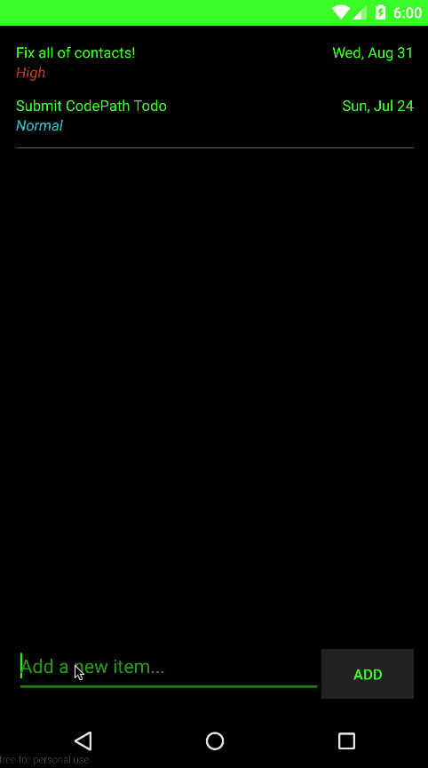

## ToDo App: Codepath Homework 0

This is the ToDo app described here: http://courses.codepath.com/snippets/intro_to_android/prework.md

### Features

#### Required
- [x] Can you successfully add and remove items from the todo list within your app?
- [x] Did you include support for editing todo items as described above?
- [x] Does your app persist todo items and retrieve them properly on app restart?
- [x] Did you successfully push your code to github? Can you see the code on github?
- [x] Did you add a README.md to the repo on github which includes a GIF walkthrough of the app's functionality?
- [x] Did you create an issue on the repo and include /cc @lita, @bblia, and @rogerhu in the issue body?

#### Optional
- [x] Suggested Persist the todo items into SQLite instead of a text file
- [x] Suggested Improve style of the todo items in the list using a custom adapter
- [x] Suggested Add support for completion due dates for todo items (and display within listview item)
- [x] Suggested Use a DialogFragment instead of new Activity for editing items
- [x] Add support for selecting the priority of each todo item (and display in listview item)
- [x] Tweak the style improving the UI / UX, play with colors, images or backgrounds

